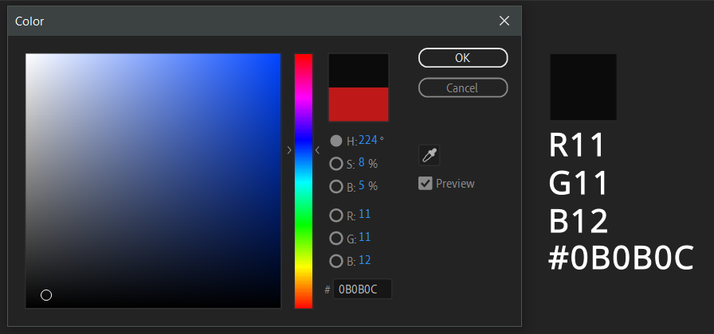

# AEFT Color Conversion expressions

## RGBToHex

> By prompt on Battleaxe Discord from user discussing how difficult they found writing an equivalent expression to be

Concise utility function to create a hex value from a given color control:

```js
const target = thisComp.layer("master").effect("Color Control")("Color");

const rgbToHex = (colorControl) => {
  const rgb = Array.from(colorControl.value, (num) =>
    Number(Math.round(num * 255))
      .toString(16)
      .padStart(2, "0")
      .toUpperCase()
  );
  rgb.pop();
  return `#${rgb.join("")}`;
};

rgbToHex(target);
```



